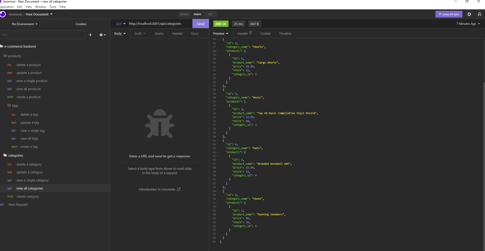

  # e-commerce-backend
  ## 
  ## Goal is to build the back end for an e-commerce site. You’ll take a working Express.js API and configure it to use Sequelize to interact with a MySQL database.
  ------------------
  ## TECHNOLOGIES USED
  ### Node.js
  ### JavaScript
  ### Insomnia
  ------------------
## SCREENSHOT

  ------------------
  ## INSTALLATION
  ### You must install the following for this app to function:
  ### Dependencies: 
  ### inquirer
  ### sequelize
  ### mysql2
  ### dotenv
  ### nodemon (optional)
  ------------------
  ## LICENSE  
  ### https://opensource.org/licenses/MIT
  ------------------
  ## DEPLOYMENT  
  ### https://christiandc19.github.io/e-commerce-backend/
  ### https://github.com/christiandc19/e-commerce-backend/
  ### Walkthrough video link: https://youtu.be/ap2fz8oALto
  ------------------
  ## QUESTIONS  
  ### If you have any questions, you may contact me at:
  ### Github: https://github.com/christiandc19 or,
  ### christiandc19@hotmail.com
